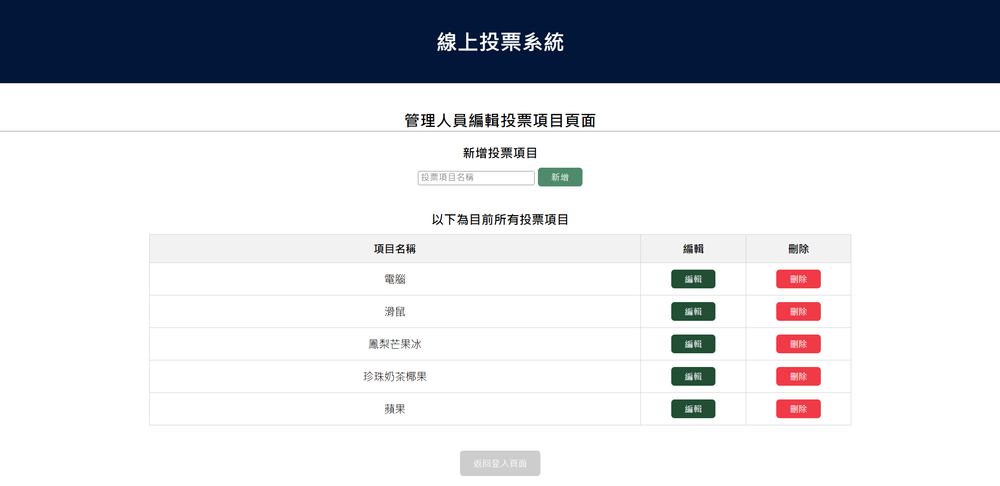
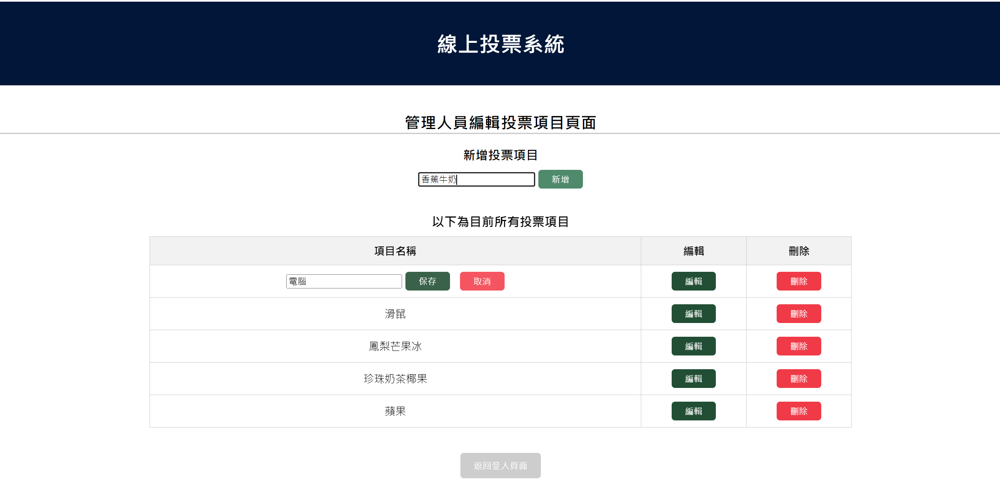
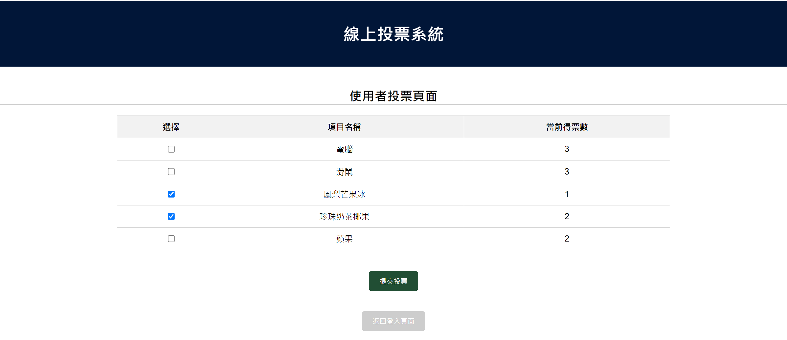

# 簡易線上投票系統

#### 登入介面

#### 管理人員介面

#### 使用者介面

### 目錄結構_前端
webvoteapp-frontend/
├── public/
├── src/
│   ├── assets/
│   ├── components/
│   │   ├── AdminPage.vue      # 管理者頁面
│   │   ├── UserPage.vue       # 使用者頁面
│   │   ├── LoginPage.vue      # 登入
│   │   └── VoteForm.vue       # 投票項目表單
│   ├── App.vue                
│   ├── main.js                
│   ├── router.js              
├── package.json               
└── ...
### 目錄結構_後端
webvoteapp-backend/
├── src/
│   ├── main/
│   │   ├── java/
│   │   │   └── com/
│   │   │       └── example/
│   │   │           └── webvoteapp/
│   │   │               ├── WebvoteappApplication.java    
│   │   │               ├── controller/
│   │   │               │   ├── VoteItemController.java   # 處理投票項目的請求
│   │   │               │   ├── VoteController.java       # 處理用戶投票的請求
│   │   │               │   └── UserController.java       
│   │   │               ├── model/
│   │   │               │   ├── VoteItem.java             
│   │   │               │   ├── Vote.java                 
│   │   │               │   └── User.java                 
│   │   │               ├── repository/
│   │   │               │   ├── VoteItemRepository.java   
│   │   │               │   ├── VoteRepository.java       
│   │   │               │   └── UserRepository.java       
│   │   │               ├── service/
│   │   │               │   ├── VoteItemService.java      
│   │   │               │   ├── VoteService.java          
│   │   │               │   └── UserService.java          
│   │   │               └── config/
│   │   │                   └── SecurityConfig.java       

